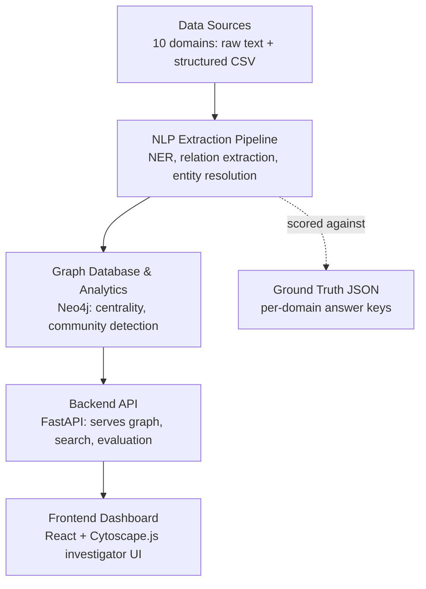

# NexusTrace — Complete Implementation Plan

**Problem Statement:** PS26189 — AI-Powered Criminal Network Analysis System
**Organization:** Ministry of Home Affairs / NCRB, Women Safety Division
**Document purpose:** Single reference for continuing project implementation — architecture, folder structure, pipeline design, backend, frontend, and build sequence.

---

## Table of Contents

1. [Project Overview](#1-project-overview)
2. [System Architecture](#2-system-architecture)
3. [Complete Folder Structure](#3-complete-folder-structure)
4. [Data Layer](#4-data-layer)
5. [Pipeline Implementation](#5-pipeline-implementation)
6. [Backend Implementation](#6-backend-implementation)
7. [Frontend Implementation](#7-frontend-implementation)
8. [Build Order / Roadmap](#8-build-order--roadmap)
9. [Setup & Getting Started](#9-setup--getting-started)
10. [Appendix A: Entity Roster (All 10 Domains)](#appendix-a-entity-roster-all-10-domains)
11. [Appendix B: Related Project Files](#appendix-b-related-project-files)

---

## 1. Project Overview

NexusTrace analyzes fragmented, unstructured crime data (FIRs, call intercepts, surveillance reports, financial records) to surface hidden relationships, identify key influencers in a criminal network, and give investigators a visual, evidence-linked graph — rather than requiring manual cross-referencing across systems.

The project treats **relationship extraction as the technical core** and the **frontend as the demo layer** — everything in this plan is sequenced accordingly: pipeline first, UI last.

**Scope for the hackathon build:** 10 fictional crime domains (narcotics trafficking, human trafficking, cyber financial fraud, arms smuggling, organized extortion, kidnapping for ransom, counterfeit currency, illegal betting/hawala, vehicle theft, land grabbing), each with synthetic unstructured documents, a machine-checkable ground-truth answer key, and one shared structured CDR/financial relationship dataset.

*Correction from earlier estimate: the 10-domain unstructured corpus totals **164 documents** (88 across Domains 1–5, 76 across Domains 6–10), not 148 as stated earlier in conversation — recomputed here for accuracy.*

---

## 2. System Architecture

### 2.1 Architecture Flow



### 2.2 Layer Descriptions

| Layer | Responsibility | Key Tech |
|---|---|---|
| Data Sources | Raw unstructured documents (10 domains) + structured CDR/financial CSV | Plain text, CSV |
| NLP Extraction Pipeline | Entity extraction, relationship extraction, entity resolution, schema normalization | Python, LLM API, spaCy (optional baseline) |
| Graph Database & Analytics | Stores the resolved network, runs centrality/community detection | Neo4j + Graph Data Science library |
| Backend API | Serves graph queries, search, document viewing, evaluation scores | FastAPI, SQLite |
| Frontend Dashboard | Interactive graph exploration, document viewer, evaluation metrics | React, TypeScript, Cytoscape.js, Tailwind |

**Design principle carried through the whole system:** the pipeline's extraction output uses the same JSON shape as each domain's Ground-Truth Extraction Prompt (entities + relationships + canonical IDs). This makes `score_against_ground_truth.py` a direct structural diff rather than a bespoke comparison per domain.

---

## 3. Complete Folder Structure

```
nexustrace/
├── README.md
├── docker-compose.yml                     # Neo4j + backend + frontend, one command up
├── .env.example
│
├── data/
│   ├── raw_text/                          # unstructured input — the 10 domains
│   │   ├── 01_narcotics_trafficking/
│   │   │   ├── batch_A.txt
│   │   │   ├── batch_B.txt
│   │   │   └── combined.txt
│   │   ├── 02_human_trafficking/
│   │   ├── 03_cyber_financial_fraud/
│   │   ├── 04_arms_smuggling/
│   │   ├── 05_organized_extortion/
│   │   ├── 06_kidnapping_for_ransom/
│   │   ├── 07_counterfeit_currency/
│   │   ├── 08_illegal_betting_hawala/
│   │   ├── 09_vehicle_theft_ring/
│   │   └── 10_land_grabbing_fraud/
│   ├── ground_truth/                      # one JSON answer key per domain (10 total)
│   │   ├── 01_narcotics_trafficking.json
│   │   ├── 02_human_trafficking.json
│   │   ├── 03_cyber_financial_fraud.json
│   │   ├── 04_arms_smuggling.json
│   │   ├── 05_organized_extortion.json
│   │   ├── 06_kidnapping_for_ransom.json
│   │   ├── 07_counterfeit_currency.json
│   │   ├── 08_illegal_betting_hawala.json
│   │   ├── 09_vehicle_theft_ring.json
│   │   └── 10_land_grabbing_fraud.json
│   ├── structured/
│   │   └── master_relationships.csv       # the 500-row CDR/financial dataset (20 columns)
│   └── processed/                         # PIPELINE OUTPUT — git-ignored, regenerated
│       ├── parsed_documents.jsonl
│       ├── extracted_entities.csv
│       ├── extracted_relationships.csv
│       └── entity_resolution_map.json
│
├── pipeline/                               # Python — the core NLP/graph engine
│   ├── requirements.txt
│   ├── config.py                          # domain registry, schema enums, model config
│   ├── ingestion/
│   │   ├── parse_documents.py             # batch .txt → {doc_id, doc_type, domain, text}
│   │   └── validate_batch.py              # runs each domain's Validation Checklist in code
│   ├── extraction/
│   │   ├── llm_extractor.py               # primary extraction (see Section 5.2)
│   │   ├── spacy_ner_baseline.py          # optional secondary/comparison model
│   │   └── prompts/
│   │       └── extraction_prompt.py
│   ├── resolution/
│   │   └── entity_resolver.py             # hardest module — alias/ID merging
│   ├── normalization/
│   │   └── schema_mapper.py               # domain-specific types → master 7-type schema
│   ├── graph/
│   │   ├── neo4j_client.py
│   │   ├── build_graph.py
│   │   └── analytics.py                   # PageRank / betweenness / Louvain
│   ├── evaluation/
│   │   └── score_against_ground_truth.py
│   └── run_pipeline.py                    # CLI: run one domain or all ten end-to-end
│
├── backend/                                # FastAPI
│   ├── requirements.txt
│   ├── main.py
│   ├── db.py                              # SQLite (metadata/jobs) + Neo4j driver init
│   ├── models/
│   │   └── schemas.py                     # Pydantic response models
│   ├── routers/
│   │   ├── documents.py
│   │   ├── entities.py
│   │   ├── graph.py
│   │   ├── pipeline.py
│   │   └── evaluation.py
│   └── services/
│       ├── graph_service.py
│       └── job_service.py
│
├── frontend/                               # React + TypeScript
│   ├── package.json
│   ├── tailwind.config.js
│   └── src/
│       ├── main.tsx
│       ├── App.tsx
│       ├── api/
│       │   └── client.ts
│       ├── pages/
│       │   ├── Dashboard.tsx
│       │   ├── GraphExplorer.tsx
│       │   ├── DocumentViewer.tsx
│       │   ├── EntityDetail.tsx
│       │   └── EvaluationMetrics.tsx
│       ├── components/
│       │   ├── graph/
│       │   │   ├── GraphCanvas.tsx        # Cytoscape.js wrapper
│       │   │   ├── GraphFilters.tsx
│       │   │   └── NodeDetailPanel.tsx
│       │   ├── search/
│       │   │   └── EntitySearchBar.tsx
│       │   ├── documents/
│       │   │   └── HighlightedText.tsx    # raw text with entity spans highlighted
│       │   └── layout/
│       │       ├── Sidebar.tsx
│       │       └── DomainSelector.tsx
│       └── types/
│           └── graph.ts
│
├── notebooks/
│   └── exploration.ipynb
│
├── tests/
│   ├── pipeline/
│   └── backend/
│
└── scripts/
    ├── compute_batch_state.py             # auto-fills BATCH-STATE NOTE from Batch A output
    └── seed_neo4j.py
```

---

## 4. Data Layer

Each of the 10 domains has three companion artifacts that all feed `data/`:

1. **Batch Generation Prompt** — produces `batch_A.txt` and `batch_B.txt` (raw synthetic documents, delimiter-fixed format: `###_DOC_START_###` → header → body).
2. **Ground-Truth Extraction Prompt** — run once per domain after both batches are generated, produces the domain's JSON answer key in `data/ground_truth/`.
3. **Validation Checklist** — a manual or scripted (`validate_batch.py`) check confirming document counts, hub-bridging counts, red-herring presence, and word-count targets were actually met before you trust the batch.

The structured `master_relationships.csv` (500 rows, 20 columns) is a separate, complementary dataset simulating CDR and financial-transaction data directly — it does not need the extraction pipeline, only `schema_mapper.py` for column-name alignment with pipeline output.

---

## 5. Pipeline Implementation

### 5.1 Module Breakdown

| Stage | File | Responsibility |
|---|---|---|
| Ingestion | `parse_documents.py` | Split `combined.txt` on the delimiter into `{doc_id, doc_type, domain, text}` records |
| Extraction | `llm_extractor.py` | Per document, extract entities + relationships as structured JSON |
| Resolution | `entity_resolver.py` | Merge "Bhai" / "the man" / "Iqbal Ansari" into one canonical node; merge linked identifiers like `KA05MN4321` ↔ `TN09PQ7788` when the text explicitly connects them |
| Normalization | `schema_mapper.py` | Collapse domain-specific relation types into the master 7-type CSV vocabulary |
| Graph | `build_graph.py` | Load normalized entities/edges into Neo4j, tagged with `domain` / `crime_category` |
| Analytics | `analytics.py` | PageRank/betweenness centrality (find the hub), Louvain community detection (find the clusters) |
| Evaluation | `score_against_ground_truth.py` | Diff pipeline output against each domain's ground-truth JSON — precision/recall on entities, relationships, hub-bridging docs, and correct red-herring exclusion |

### 5.2 Extraction Method — Why LLM-First

With only 164 documents spread across 10 domains, there isn't enough data to reliably fine-tune a from-scratch spaCy/transformer NER+RE model that generalizes well. An LLM-based extractor — a few-shot prompt using the same JSON schema as the Ground-Truth Extraction Prompt, run per document — will be more accurate and far faster to implement.

Keep `spacy_ner_baseline.py` as an **optional secondary model**: training and comparing it against the LLM extractor is a legitimate "we built our own ML model" talking point for judges, but it should not be the primary path if time is limited. Recommended sequence: get the LLM extractor working end-to-end first, add the spaCy baseline only if time permits afterward.

### 5.3 Schema Normalization Mapping

`schema_mapper.py` should **preserve the original label** as a `raw_relationship_type` property on the graph edge rather than discarding it when collapsing to the coarser schema — you lose evaluation granularity otherwise.

| Domain-specific type | Master `relationship_type` |
|---|---|
| `MET`, `COORDINATED_MOVEMENT` | `CO_LOCATED_WITH` |
| `INSTRUCTED`, `ASSOCIATED_WITH`, `FORGED_DOCUMENT_FOR` | `ASSOCIATE_OF` |
| `ARRANGED_PAYMENT`, `ARRANGED_FUNDS`, `RECEIVED_PAYMENT`, `SETTLED_PAYMENT_VIA_HAWALA` | `FINANCIAL_TRANSACTION_WITH` |
| `HANDED_OFF_VEHICLE`, `RE_REGISTERED_VEHICLE` | `OWNS_VEHICLE` |
| `ARRANGED_RANSOM_DROP`, `DISTRIBUTED_CONSIGNMENT` | `ASSOCIATE_OF` (fallback — logistics isn't a master-schema category) |
| `CALLED` | `CALLED` (already aligned) |

Also normalize `PHONE` → `PHONE_NUMBER` if any older ground-truth files from Domains 1–5 predate that fix.

---

## 6. Backend Implementation

### 6.1 Stack & Reasoning

**Python + FastAPI**, not Node — worth stating plainly given a JS/TS-leaning stack preference elsewhere in the project: the pipeline itself is inherently Python (spaCy, transformer libraries, the Neo4j Python driver, pandas), and there's no real benefit to inserting a separate Node API layer in front of it on a hackathon timeline. TypeScript stays where it earns its keep — the frontend.

### 6.2 Storage Strategy

- **Neo4j** — the graph itself (entities, relationships, centrality/community results).
- **SQLite** — document metadata, pipeline job status, and evaluation results: things that aren't graph-shaped and don't belong in Neo4j. Upgradeable to Postgres later without a redesign.

### 6.3 Background Job Handling

At this data scale (164 documents, 500 CSV rows), synchronous processing inside a FastAPI `BackgroundTasks` call is sufficient. Celery/Redis would be over-engineering here — only reach for a real task queue if the document volume scales into the thousands.

### 6.4 API Endpoints

| Endpoint | Purpose |
|---|---|
| `POST /pipeline/run` | Trigger extraction for one domain or all ten |
| `GET /pipeline/status/{job_id}` | Poll job progress |
| `GET /documents/{doc_id}` | Raw text plus its extracted entity/relationship spans |
| `GET /entities` | Search/list resolved entities (filter by domain, type) |
| `GET /entities/{id}` | Entity detail — all relationships, evidence documents, merged aliases |
| `GET /graph` | Subgraph for a domain, or the full merged graph |
| `GET /graph/centrality` | Key-influencer ranking |
| `GET /graph/communities` | Detected clusters |
| `GET /evaluation/{domain}` | Precision/recall vs that domain's ground truth |

---

## 7. Frontend Implementation

### 7.1 Stack & Reasoning

**React + TypeScript + Cytoscape.js + Tailwind.** Cytoscape.js is chosen over D3/Sigma specifically because it ships with centrality-aware layouts and click/hover interaction built in — for an investigator-facing tool, interaction needs to work on day one, not after hand-rolling force-simulation code.

### 7.2 Pages & Components

| Page | What it shows |
|---|---|
| Dashboard | Summary cards: total entities, relationships, active domains, top-ranked hub entities across all 10 crime categories |
| Graph Explorer | The main deliverable — interactive Cytoscape canvas, filterable by domain/entity type/relationship type/confidence; node size/color driven by centrality score; cluster color-coding from community detection; click a node → detail panel |
| Document Viewer | Raw FIR/intercept/surveillance text with extracted entity spans highlighted inline — this is what makes "the AI actually read this" visible to judges |
| Entity Detail | All relationships for one entity, every alias merged into it, every source document as evidence |
| Evaluation Metrics | Precision/recall per domain against ground truth — the strongest demo slide, since it proves the system works rather than just looks good |

### 7.3 Key UX Notes

- `DomainSelector.tsx` should support both a "single domain" view and a "merged master graph" view. The merged view is where Iqbal Ansari resolving to the same node across all 10 rackets actually becomes visible — arguably the single most impressive moment in a live demo.
- `HighlightedText.tsx` should link highlighted spans back to `EntityDetail.tsx` so a judge can click an entity mention in a raw FIR and jump straight to its resolved graph node.

---

## 8. Build Order / Roadmap

1. **Pipeline core** — ingestion → LLM extraction → entity resolution → normalization. Test against 1–2 domains first (Narcotics + Extortion, since real sample output already exists for Narcotics).
2. **Graph + evaluation** — load into Neo4j, run analytics, score against ground truth. Close this loop before touching the UI — it's the part that actually proves the project works.
3. **Backend API** — a thin wrapper over what step 2 already produces.
4. **Frontend** — Graph Explorer and Document Viewer first (the demo centerpieces); Dashboard and Evaluation Metrics last (they're aggregations of data already available by then).
5. **Scale to all 10 domains** only after the pipeline is proven correct on 2 — regenerating and re-running text batches is cheap; debugging a broken pipeline across 164 documents at once is not.

---

## 9. Setup & Getting Started

**Prerequisites:** Python 3.11+, Node 18+, Docker (for Neo4j), an LLM API key for the extraction step.

Core dependencies to plan for:

- **Pipeline/Backend (Python):** `fastapi`, `uvicorn`, `neo4j`, `pandas`, `pydantic`, `spacy` (optional baseline), `rapidfuzz` (fuzzy alias matching in entity resolution)
- **Frontend (Node):** `react`, `typescript`, `cytoscape`, `tailwindcss`, `axios` or `fetch`-based API client

**Suggested first commands once folders are scaffolded:**
```bash
# Neo4j via Docker
docker run -d --name nexustrace-neo4j -p7474:7474 -p7687:7687 \
  -e NEO4J_AUTH=neo4j/password neo4j:5-community

# Pipeline/backend environment
cd pipeline && pip install -r requirements.txt --break-system-packages
cd ../backend && pip install -r requirements.txt --break-system-packages

# Frontend environment
cd frontend && npm install
```

---

## Appendix A: Entity Roster (All 10 Domains)

Consolidated from the domain prompt files — useful for writing test fixtures and sanity-checking `entity_resolver.py` output. Iqbal Ansari's phone (`+91 99870 XXXXX`) is shared across every domain where his `CALLED` relationship appears directly.

| # | Domain | Hub alias | Field operatives | Other fixed entities |
|---|---|---|---|---|
| 1 | Narcotics Trafficking | "Sethji" (Iqbal Ansari) | Devendra Solanki alias "Bunty" (courier); Iliyas Khan (handler) | Vehicle MH12AB5678 |
| 2 | Human Trafficking | "the contact" / "I.A." (Iqbal Ansari) | Manoj Tiwari (Lucknow recruiter); Rina Das (Kolkata recruiter) | Front: "Sunrise Placement Services" |
| 3 | Cyber Financial Fraud | "the director" (Iqbal Ansari) | Rohit Chaurasia (call-center operator); Farhan Qureshi (mule-account manager) | Shell: "IA Digital Ventures Pvt Ltd"; mule holders Ashraf Mallick, Nilesh Kadam |
| 4 | Arms Smuggling | "the financier" (Iqbal Ansari) | Harjeet Singh (transporter); Waseem Akhtar (storage contact) | Vehicle PB10GH4321 |
| 5 | Organized Extortion | "Bhai" (Iqbal Ansari) | Rakesh Pawar alias "Rocky"; Salim Sheikh | Vehicle MH04XY2345 |
| 6 | Kidnapping for Ransom | "the negotiator" (Iqbal Ansari) | Sunil Yadav (driver); Ajay Bhonsle (drop point/family monitoring) | Vehicle UP32XY9988 |
| 7 | Counterfeit Currency | "the source contact" (Iqbal Ansari) | Naseer Ahmed (courier); Vikas Chopra (exchanger) | Front: "Chopra Fuel & Service Station" |
| 8 | Illegal Betting & Hawala | "the controller" (Iqbal Ansari) | Deepak Malhotra alias "Bookie"; Rizwan Ali (hawala operator) | — |
| 9 | Vehicle Theft & Re-Registration | "the buyer" (Iqbal Ansari) | Anil Kamble (thief); Ramesh Naidu (re-registration front) | Vehicle identity link: KA05MN4321 → TN09PQ7788 |
| 10 | Land Grabbing & Property Fraud | "the fixer" (Iqbal Ansari) | Prakash Jadhav (enforcer); Advocate Rajendra Kulkarni (document forger) | Front: "Shreeji Construction & Developers" |

---

## Appendix B: Related Project Files

Generated earlier in this project and referenced throughout this plan:

- `nexustrace_synthetic_data_prompts.md` — original 5-prompt pack (NER training data, relationship-extraction triples, CDR, financial transactions, ground-truth graph)
- `nexustrace_crime_specific_dataset_prompts.md` — 6 structured-CSV generator prompts (the 500-row, 20-column `master_relationships.csv` source)
- `nexustrace_crime_specific_text_prompts.md` — Domains 1–5 unstructured text generator prompts
- `SIH189_Domains_6to10_New_Crime_Categories.md` — Domains 6–10 unstructured text generator prompts, batched, delimiter-fixed
- `SIH189_All_Domain_Prompts.md` (user-provided) — the batched, ground-truth-extraction version of Domains 1–5 that this plan's pipeline design is built around
- `SIH189_Sample_Batch_A.md` (user-provided) — validated sample output confirming the prompt design works end-to-end
